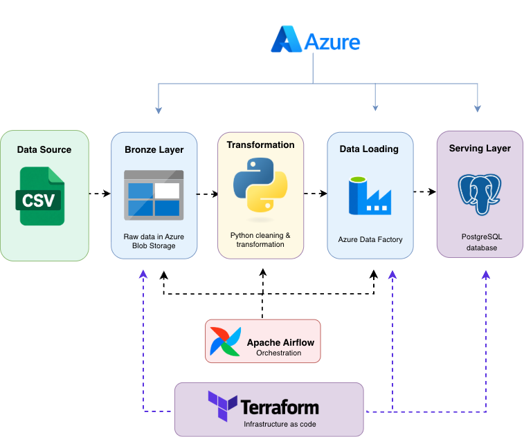

# Civic Pulse Urban Service Requests

Civic Pulse is a data engineering project that processes urban service request data and prepares it for analysis. The aim of the project is to move raw service request data through a structured pipeline, clean and transform it, store it in an analysis-ready database, and automate the workflow.

## Architecture



Apache Airflow is used for workflow orchestration, while Terraform is used to manage the Azure infrastructure as code.

## Tech Stack

- Python
- Polars
- Azure Blob Storage
- Azure Data Factory
- Azure Database for PostgreSQL
- Apache Airflow
- Astronomer Astro CLI
- Terraform
- Docker
- Git

## Data Pipeline

### Bronze
The raw CSV file is uploaded to Azure Blob Storage without changing the original data.

### Silver
The raw data is cleaned and transformed using Polars. The transformed dataset is then stored as Parquet in the Silver container.

### Gold
Azure Data Factory moves the Silver data into Azure PostgreSQL, where it is stored in an analysis-ready table.

## Automation
Apache Airflow is used to orchestrate the different stages of the pipeline. The Airflow environment runs locally using Astronomer Astro and containers.

## Infrastructure as Code
Terraform is used to define and manage the Azure infrastructure used by the project, including:
- Resource groups
- Storage resources
- Azure Data Factory
- Linked services
- Parquet datasets
- PostgreSQL resources

## Project Structure
```text
Civic Pulse Urban City Service Requests/
|
├── dags/
├── images/
│   ├── architecture.png
├── scripts/
│   ├── upload_raw_data.py
│   └── transform.py
├── terraform/
│   ├── main.tf
│   ├── variables.tf
│   └── .terraform.lock.hcl
├── requirements.txt
├── Dockerfile
└── README.md
```

## Outcome
The project shows how raw public-service data can be moved through a Bronze, Silver and Gold architecture and prepared for further reporting and analysis.